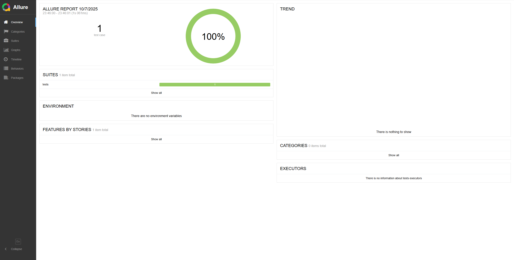

## Тестовое задание SDET

## Задание 1

### Проект автоматизированного тестирования веб-формы на тестовом сайте, предназначенный для получения практического опыта написания автоматизированного теста по заполнению веб-формы с различными типами полей ввода. 

## 🏗️Структура проекта

| Компонент                   | Назначение                          |
|-----------------------------|-------------------------------------|
| **📁 КОРНЕВЫЕ ФАЙЛЫ**       |                                     |
| `.gitignore`                | 🚫 Исключения для Git               |
| `requirements.txt`          | 📦 Зависимости Python               |
| `conftest.py`               | ⚙️ Фикстуры Pytest                  |
| `data.py`                   | 🗃️ Тестовые данные                 |
| `helpers.py`                | 🛠️ Вспомогательные методы          |
| `urls.py`                   | 🌐 URL-адреса тестового окружения   |
| **📁 ДИРЕКТОРИИ ПРОЕКТА**   |                                     |
| **allure_results/**         | 📊 **Результаты тестов Allure**     |
| └─ `*.json`                 | 📄 Raw-данные для генерации отчетов |
| **locators/**               | 📁 **Локаторы элементов**           |
| └─ `form_fields_locator.py` | 🔎 Локаторы элементов веб-формы     |
| **pages/**                  | 📁 **Page Object модели**           |
| └─ `base_page.py`           | 🏗️ Базовый класс с общими методами  |
| └─ `form_fields_page.py`    | 🛠️ Методы работы с веб-формой       |
| **screenshots/**            | 📁 **Скриншоты тестов**          |
| **tests/**                  | 📁 **Тестовые сценарии**         |
| └─ `test_form_filling.py`   | ✅ Тест заполнения веб-формы      |

## <h>Инструкция по запуску</h>

### 1. Установить зависимости:

> pip install -r requirements.txt</h>

### 2. Запустить тест и записать отчет:

> pytest --alluredir=allure_results

### 3. Посмотреть отчет по прогону html:

> allure serve allure_results

## Пример отчета Allure

## Задание 2

## 📋 Тест-кейсы для формы Form Fields

### ТК-1: Позитивный сценарий - Успешное заполнение и отправка формы

**Приоритет:**
- Высокий

**Предусловия:**
- Открыт браузер
- Переход на страницу https://practice-automation.com/form-fields/

**Шаги:**
1. Заполнить поле Name значением "Vladimir"
2. Заполнить поле Password значением "Pass1234"
3. Выбрать в списке drinks опции Milk и Coffee
4. Выбрать в списке color опцию Yellow
5. Выбрать вариант Yes для поля Do you like automation?
6. Заполнить поле Email значением "kozhevnikovulstu@yandex.ru"
7. Заполнить поле Message текстом "Количество инструментов - 5. Наибольшее количество символов в инструменте - Katalon Studio."
8. Нажать кнопку Submit

**Ожидаемый результат:**
- Появляется алерт с текстом "Message received!"

### ТК-2: Негативный сценарий - Попытка отправки формы с пустым обязательным полем Name

**Приоритет:**
- Высокий

**Предусловия:**
- Открыт браузер
- Переход на страницу https://practice-automation.com/form-fields/

**Шаги выполнения:**
1. Оставить поле Name пустым
2. Заполнить поле Password значением "Pass1234"
3. Выбрать в списке drinks опции Milk и Coffee
4. Выбрать в списке color опцию Yellow
5. Выбрать вариант Yes для поля Do you like automation?
6. Заполнить поле Email значением "kozhevnikovulstu@yandex.ru"
7. Заполнить поле Message текстом "Количество инструментов - 5. Наибольшее количество символов в инструменте - Katalon Studio."
8. Нажать кнопку Submit

**Ожидаемый результат:**
- Алерт "Message received!" не появляется
- Страница проскроливается к полю Name
